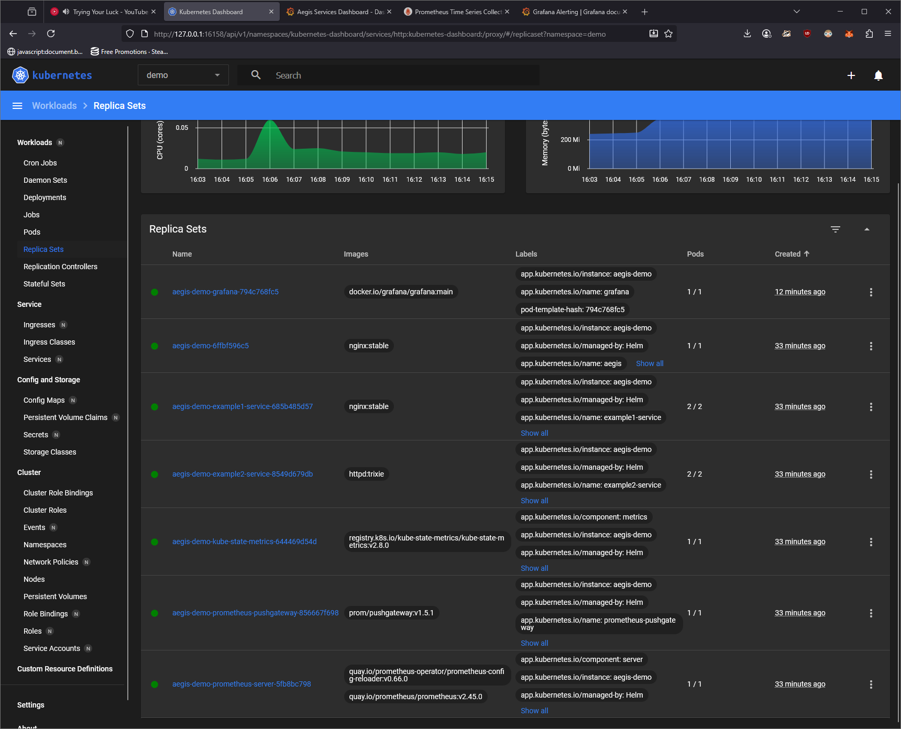
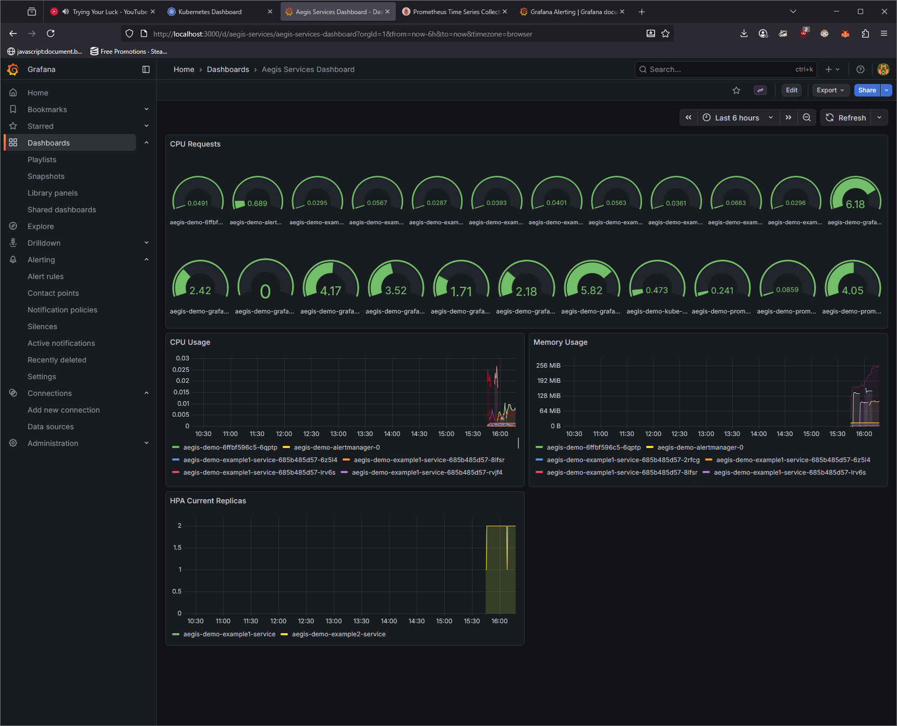
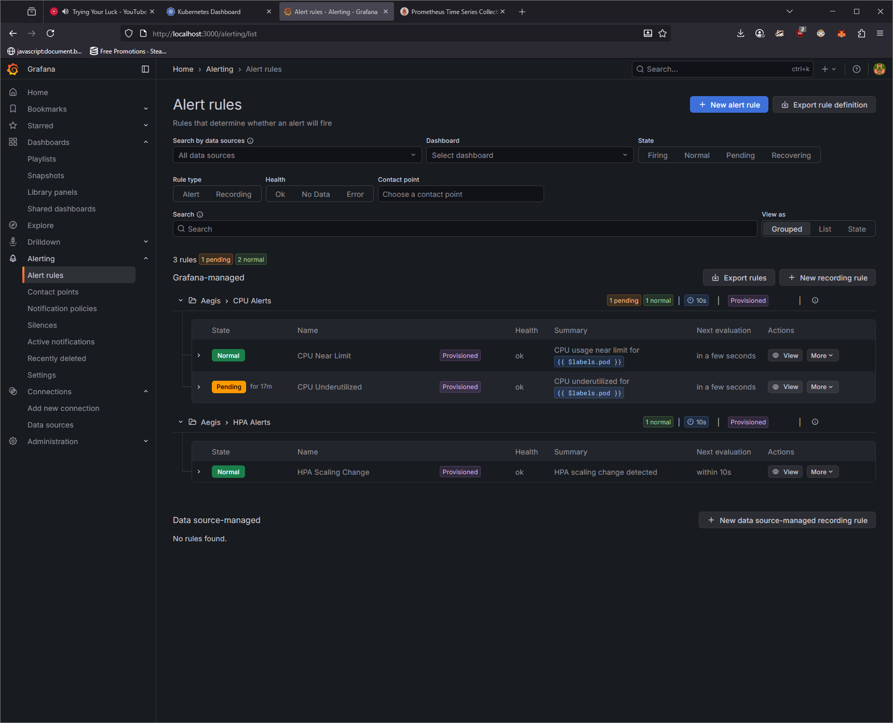
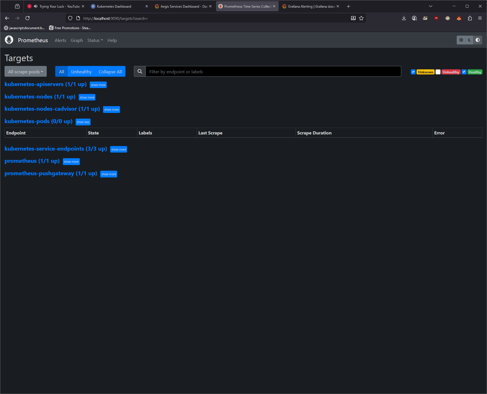

# 🛡️ PROJECT AEGIS 🛡️

This project is a demo of a self-healing infrastructure. It ships with:

- **Monitoring**: Grafana, Prometheus
- **Example Apps**: Nginx (example1-service), Apache httpd (example2-service)
- **Alerting**: Grafana Alerts

## Prerequisites
- Kubernetes cluster (tested with [minikube](https://minikube.sigs.k8s.io/docs/))
- [kubectl](https://kubernetes.io/docs/reference/kubectl/) configured to access your cluster
- [Helm](https://helm.sh/)
- At least 4GB available memory in your cluster

## Usage

### Installation

    make install

### Removal

    make uninstall

### Access

    make dashboard

### Users

#### Grafana

Username:   `admin`

Password:   `admin123`

## Architecture
This self-healing infrastructure demo consists of:
- **Monitoring Stack**: Prometheus collects metrics, Grafana visualizes them
- **Example Services**: Nginx and httpd as sample applications to monitor
- **Alert System**: Grafana Alerts for notifications
- **Auto-scaling**: HPA (Horizontal Pod Autoscaler) to automatically scale services

## Screenshots

### K8s Dashboard

### Grafana

### Alerting

### Prometheus

## Customization
Edit the values in `IaC/charts/aegis/*` to:
- Adjust resource limits and requests
- Modify alert thresholds
- Configure notification channels
- Change deployment parameters

### Available Commands
- `make install`: Deploy the entire stack
- `make uninstall`: Remove all components
- `make update-deps`: Updates dependencies
- `make dashboard`: Open dashboards in browser tabs
- `make upgrade`: Apply configuration changes